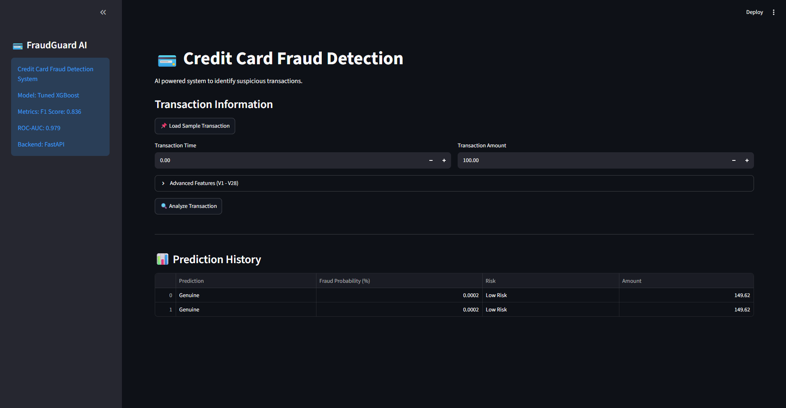
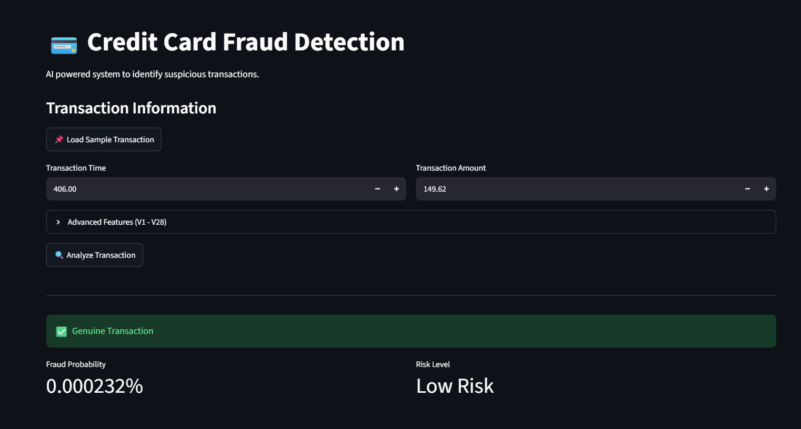

# 💳 FraudGuard AI - Credit Card Fraud Detection System

## 📌 Project Overview

**FraudGuard AI** is an end-to-end Machine Learning based Credit Card Fraud Detection System that identifies fraudulent transactions using advanced classification algorithms.

The project handles highly imbalanced transaction data and provides real-time fraud prediction through a **FastAPI backend** and an interactive **Streamlit dashboard**.

The system predicts whether a transaction is **Fraudulent or Genuine** and provides a fraud probability score with risk analysis.

---

# 🚀 Features

* Exploratory Data Analysis (EDA)
* Data preprocessing and feature analysis
* Handling highly imbalanced fraud dataset
* Model training and comparison
* Hyperparameter tuning
* XGBoost based fraud detection model
* Real-time prediction API using FastAPI
* Interactive Streamlit dashboard
* Fraud probability prediction
* Risk level classification
* Prediction history storage

---

# 🛠️ Tech Stack

## Programming Language

* Python

## Machine Learning

* Pandas
* NumPy
* Scikit-learn
* XGBoost
* Joblib

## Backend

* FastAPI
* Uvicorn

## Frontend

* Streamlit

## Development Tools

* Jupyter Notebook
* Git
* GitHub

---

# 📂 Project Structure

```
FraudGuard-AI/

│
├── api/
│   └── app.py                  # FastAPI backend API
│
├── src/
│   └── predict.py              # Prediction logic
│
├── models/
│   └── fraud_model.pkl         # Trained ML model
│
├── notebooks/
│   ├── 01_EDA.ipynb            # Data exploration
│   ├── 02_Preprocessing.ipynb  # Data cleaning & preprocessing
│   └── 03_Model_Training.ipynb # Model training & evaluation
│
├── data/
│   ├── raw/
│   │   └── creditcard.csv      # Original dataset
│   │
│   └── predictions/
│       └── predictions.csv     # Prediction history
│
├── streamlit_app.py            # User interface
│
├── requirements.txt            # Dependencies
│
├── README.md
│
└── .gitignore

```

---

# 📊 Dataset

Dataset used:

**Credit Card Fraud Detection Dataset**

Source:
Kaggle - Credit Card Fraud Detection Dataset

The dataset contains transactions made by European cardholders.

Features:

* Time
* Amount
* V1 - V28 (PCA transformed features)

Target:

* Class

where:

* 0 → Genuine Transaction
* 1 → Fraud Transaction

---

# 🔍 Machine Learning Workflow

The project follows this ML pipeline:

```
Data Collection
        |
        ↓
Exploratory Data Analysis
        |
        ↓
Data Preprocessing
        |
        ↓
Handling Class Imbalance
        |
        ↓
Model Training
        |
        ↓
Model Evaluation
        |
        ↓
Hyperparameter Tuning
        |
        ↓
Model Deployment
```

---

# 🤖 Models Used

The following classification models were evaluated:

* Logistic Regression
* Decision Tree
* Random Forest
* XGBoost

# 📊 Model Evaluation Matrix

| Model | Accuracy | Precision | Recall | F1 Score | ROC-AUC |
|---|---|---|---|---|---|
| XGBoost | 99.9595% | 97.3684% | 77.8947% | 86.5497% | 97.2770% |
| Random Forest | 99.9489% | 97.1429% | 71.5789% | 82.4242% | 94.4683% |
| Decision Tree | 99.9013% | 73.4940% | 64.2105% | 68.5393% | 82.0858% |
| Logistic Regression | 97.2192% | 5.0334% | 87.3684% | 9.5183% | 95.7940% |

# 🏆 Final Model Selection

## XGBoost Classifier

XGBoost was selected as the final production model because it achieved the best overall performance.

### Why XGBoost?

- Highest F1 Score (0.865)
- Highest Precision (0.974)
- Excellent Recall (0.779)
- Highest Accuracy (0.999595)
- Strong performance on highly imbalanced fraud detection data


Final Performance:

Accuracy  : 99.9595%

Precision : 97.3684%

Recall    : 77.8947%

F1 Score  : 86.5497%

ROC-AUC   : 97.2770%

---

# ⚙️ Installation and Setup

## 1. Clone Repository

```bash
git clone <your-github-repository-link>

cd FraudGuard-AI
```

---

## 2. Create Virtual Environment

```bash
python -m venv venv
```

Activate environment:

### Windows

```bash
venv\Scripts\activate
```

### Linux/Mac

```bash
source venv/bin/activate
```

---

## 3. Install Dependencies

```bash
pip install -r requirements.txt
```

---

# ▶️ Running the Application

The project contains two applications:

* FastAPI Backend
* Streamlit Frontend

## Start FastAPI Server

Open terminal:

```bash
uvicorn api.app:app --reload
```

API will run at:

```
http://127.0.0.1:8000
```

## Start Streamlit Dashboard

Open another terminal:

```bash
streamlit run streamlit_app.py
```

Dashboard will open in browser.

---

# 🔮 API Usage

## Endpoint

```
POST /predict
```

Example Request:

```json
{
 "Time":406.0,
 "Amount":149.62,
 "V1":-1.359807,
 "V2":-0.072781,
 "V3":2.536347
}
```

Example Response:

```json
{
 "prediction":"Genuine",
 "fraud_probability":0.000034
}
```

---

# 🖥️ Application Features

The Streamlit dashboard provides:

* Transaction input
* Fraud prediction
* Probability score
* Risk classification

Risk Levels:

| Probability | Risk        |
| ----------- | ----------- |
| < 30%       | Low Risk    |
| 30-70%      | Medium Risk |
| >70%        | High Risk   |

---
# 🖥️ Application Screenshots

## Streamlit Dashboard

The interactive dashboard allows users to enter transaction details and analyze suspicious activities.




## Fraud Prediction Result

The system provides fraud prediction, probability score, risk level, and stores prediction history.



# 📈 Future Improvements

* Batch transaction prediction using CSV upload
* Database integration
* Cloud deployment
* Model monitoring system
* Real-time transaction streaming
* MLOps pipeline integration

---

# 👨‍💻 Author

**Mithil Sachani**

B.Tech Information Technology Student

---

⭐ If you find this project useful, consider giving it a star on GitHub.
